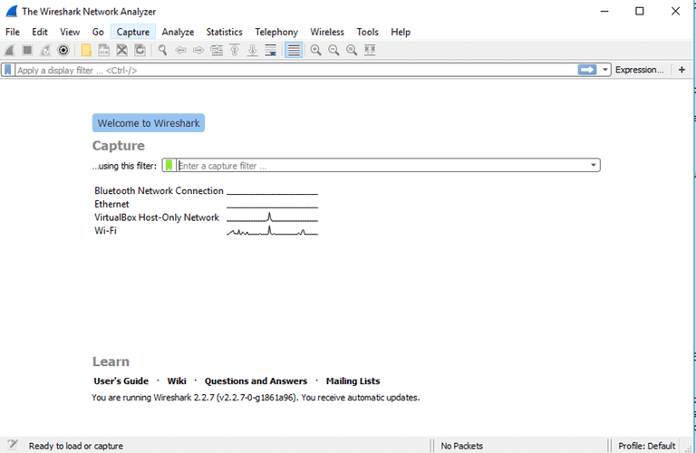

|[Table of Contacts](/00-Table-of-Contents.md)|
|---|

---

## Wireshark

#### Reference:  [https://www.wireshark.org/docs/wsug\_html\_chunked/](https://www.wireshark.org/docs/wsug_html_chunked/)

Wireshark is a GUI based protocol analyzer. It works on live traffic and PCAP files.

When you first launch Wireshark a welcome screen similar to the one shown above should be visible, containing a list of available network connections on your current device. In this example, you'll notice that the following connection types are shown: _Bluetooth Network Connection_, _Ethernet_, _VirtualBox Host-Only Network_, _Wi-Fi_. Displayed to the right of each is an EKG-style line graph that represents live traffic on that respective network.

To begin capturing packets, first select one or more of these networks by clicking on your choice\(s\) and using the _Shift_ or _Ctrl_ keys if you'd like to record data from multiple networks simultaneously. Once a connection type is selected for capturing purposes, its background will be shaded in either blue or gray. Click on _Capture_ from the main menu, located towards the top of the Wireshark interface. When the drop-down menu appears, select the _Start_ option.

You can also initiate packet capturing via one of the following shortcuts.

* **Keyboard:**

   Press _Ctrl + E_

* **Mouse:**

   To begin capturing packets from one particular network, simply double-click on its name

* **Toolbar:**

   Click on the blue shark fin button, located on the far left-hand side of the Wireshark toolbar

The live capture process will now begin, with packet details displayed in the Wireshark window as they are recorded. Perform one of the actions below to stop capturing.

* **Keyboard:**

   Press _Ctrl + E_

* **Toolbar:**

   Click on the red stop button, located next to the shark fin on the Wireshark toolbar

---

|[Next Topic](/02-intro-to-networking/wireshark/wireshark-installation-and-setup..md)|
|---|
