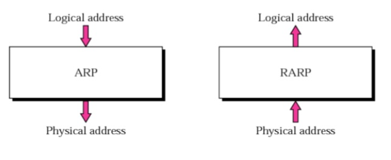

<a href="https://github.com/CyberTrainingUSAF/08-Network-Programming/blob/master/00-Table-of-Contents.md" rel="Return to TOC"> Return to TOC </a>

# Reverse Address Resolution Protocol

**RARP** \(Reverse Address Resolution Protocol\) is a protocol by which a physical machine in a local area network can request to learn its IP address from a gateway server's Address Resolution Protocol \(ARP\) table or cache. A network administrator creates a table in a local area network's gateway router that maps the physical machine addresses \(or Media Access Control - MAC address\) to corresponding Internet Protocol addresses. When a new machine is set up, its RARP client program requests from the RARP server on the router to be sent its IP address. Assuming that an entry has been set up in the router table, the RARP server will return the IP address to the machine which can store it for future use.

---
<a href="https://github.com/CyberTrainingUSAF/08-Network-Programming/blob/master/04-osi-layer-2/review.md" > Continue to Next Topic </a>
