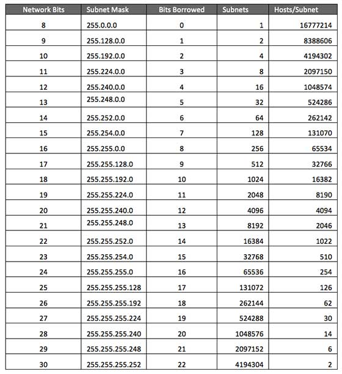
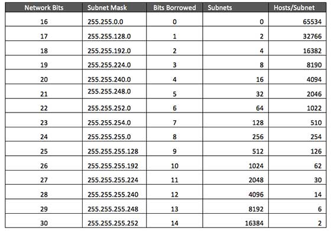

|[Table of Contents](/00-Table-of-Contents.md)|
|---|

---

## Subnet Mask

Subnet masks were introduced to identify the **NETWORK** and **HOST** bits of an IP.

Subnet masks are a special kind of IPv4 address used in tandem with a normal IPv4 addresses to provide that context.

They are used when configuring interfaces of network devices \(PC's, Routers, etc\). They are NOT transmitted with regular network traffic.

Subnet masks are a contiguous block of 1's followed by any remaining bits set to contiguous 0's. The contiguous bits may span several octets.

Mixing 1's and 0's together is not allowed. This means that the only valid numbers in a subnet mask are: \(0, 128, 192, 224, 240, 248, 252, 254, 255\)

`255 .255 .248 .0`

`11111111 .11111111 .11111000 .0`

All bits in the IP address that are masked with 1's determine the NETWORK, and all 0's determine the HOST

## Class A Subnets

If you bitwise AND an IP and a subnet mask, you will get the network IP.

### **IP:**    172.16.237.18

### **SM:**   255.255.248.0

### **IP:**                `10101100.00010000.11101 | 101.00010010`

### **SM:**              `11111111.11111111.11111 | 000.00000000`

### **Network IP:** `10101100.00010000.11101 | 000.00000000`

### Network IP: 172.16.232.0

## Class B Subnets

## Class C Subnets

---

|[Next Topic](/05-osi-layer-3/cidr.md)|
|---|
