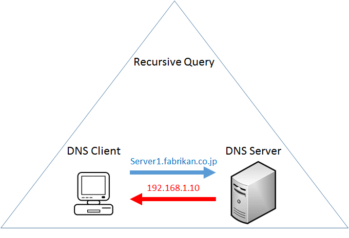
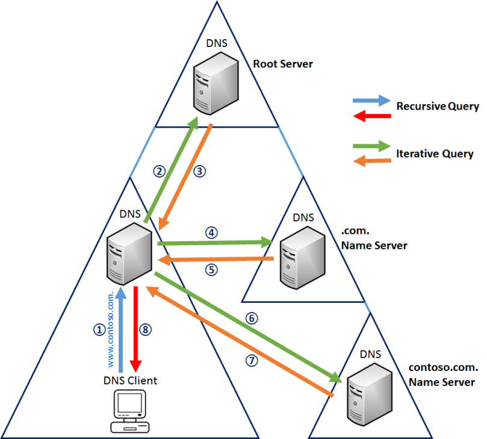

<a href="https://github.com/CyberTrainingUSAF/08-Network-Programming/blob/master/00-Table-of-Contents.md" > Return to TOC </a>

# DNS Resolution

* Resolving addresses are performed with DNS Request messages.
* DNS requests may be iterative or recursive. At almost every step, the cache of the current system is checked before attempting another query to reduce the load on higher servers.
* Recursive requests allow the recipient of a DNS query to make it's own DNS query. That recipient can make it's own query if needed. This is the typical method.
* Iterative requests mean the host expects the DNS server to reply immediately, without asking any other DNS servers. The reply will either be from the cache, or a referral to another name server. Iterative requests may then be made by the initial host if needed.
* If at any point there is a known resolution, it is passed back down immediately. No need to bother anyone else in the chain. This answer will be cached as it goes back down.

---

<a href="https://github.com/CyberTrainingUSAF/08-Network-Programming/blob/master/07-osi-layer-7/dig-output.md" > Continue to Next Topic </a>
