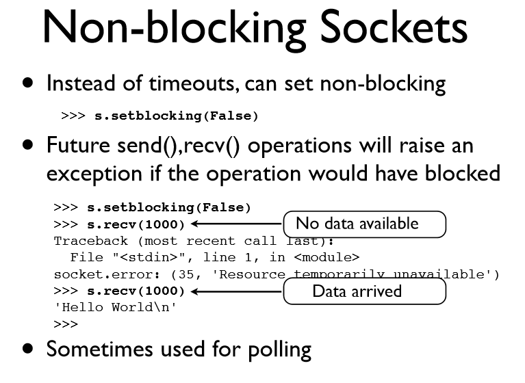

<a href="https://github.com/CyberTrainingUSAF/08-Network-Programming/blob/master/00-Table-of-Contents.md" > Continue to Next Topic </a>

# Socket Blocking

By default, TCP sockets are placed in a blocking mode. This means the control is not returned to your program until some specific operation is complete. For example, if you call the`connect()`API, the connection blocks your program until the operation is complete. On many occasions, you don't want to keep your program waiting forever, either for a response from the server or for any error to stop the operation. For example, when you write a web browser client that connects to a web server, you should consider a stop functionality that can cancel the connection process in the middle of this operation. This can be achieved by placing the socket in the non-blocking mode.



## How to do it...

Let us see what options are available under Python. In the non-blocking mode, if any call to API, for example,`send()`or`recv()`, encounters any problem, an error will be raised. However, in the blocking mode, this will not stop the operation. We can create a normal TCP socket and experiment with both the blocking and non-blocking operations.

In order to manipulate the socket's blocking nature, we need to create a socket object first.

We can then call`setblocking(1)`to set up blocking or`setblocking(0)`to unset blocking. Finally, we bind the socket to a specific port and listen for incoming connections.

Listing 1.9 shows how the socket changes to blocking or non-blocking mode as follows:

```text
import socket

def test_socket_modes():
    s = socket.socket(socket.AF_INET, socket.SOCK_STREAM)
    s.setblocking(1)
    s.settimeout(0.5)
    s.bind(("127.0.0.1", 0))

    socket_address = s.getsockname()
    print "Trivial Server launched on socket: %s" %str(socket_address)
    while(1):
        s.listen(1)

if __name__ == '__main__':
    test_socket_modes()
```

If you run this, it will launch a trivial server that has the blocking mode enabled as shown in the following command:

```text
$ python 1_9_socket_modes.py 
Trivial Server launched on socket: ('127.0.0.1', 51410)
```

## How it works...

In this example, we enable blocking on a socket by setting the value`1`in the`setblocking()`method. Similarly, you can unset the value`0`in this method to make it non-blocking.

---

<a href="https://github.com/CyberTrainingUSAF/08-Network-Programming/blob/master/08-advanced-functionality/select/README.md" > Continue to Next Topic </a>
