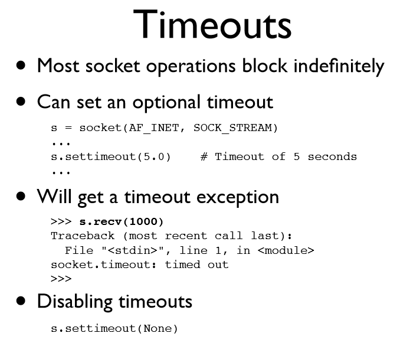

<a href="https://github.com/CyberTrainingUSAF/08-Network-Programming/blob/master/00-Table-of-Contents.md" > Continue to Next Topic </a>

# Socket Timeout

Sometimes, you need tomanipulate the default values of certain properties of a socket library,for example, the socket timeout.



## How to do it...

You can make an instance of a socket object and call a`gettimeout()`method to get the default timeout value and the`settimeout()`method to set a specific timeout value. This is very useful in developing custom server applications.

We first create a socket object inside a`test_socket_timeout()`function. Then, we can use the getter/setter instance methods to manipulate timeout values.

Listing 1.6 shows`socket_timeout`as follows:

```text
import socket

def test_socket_timeout():
    s = socket.socket(socket.AF_INET, socket.SOCK_STREAM)
    print "Default socket timeout: %s" %s.gettimeout()
    s.settimeout(100)
    print "Current socket timeout: %s" %s.gettimeout()    

if __name__ == '__main__':
    test_socket_timeout()
```

After running the preceding script, you can see how this modifies the default socket timeout as follows:

```text
$ python 1_6_socket_timeout.py 
Default socket timeout: None
Current socket timeout: 100.0
```

## How it works...

In this code snippet, we have first created a socket object by passing the socket family and socket type as the first and secondarguments of the socket constructor. Then, you can get the socket timeout value by calling`gettimeout()`and alter the value by calling the`settimeout()`method. The timeout value passed to the`settimeout()`method can be in seconds \(non-negative float\) or`None`. This method is used for manipulating the blocking-socket operations. Setting a timeout of`None`disables timeouts on socket operations.

<a href="https://github.com/CyberTrainingUSAF/08-Network-Programming/blob/master/08-advanced-functionality/socket-blocking.md" > Continue to Next Topic </a>
