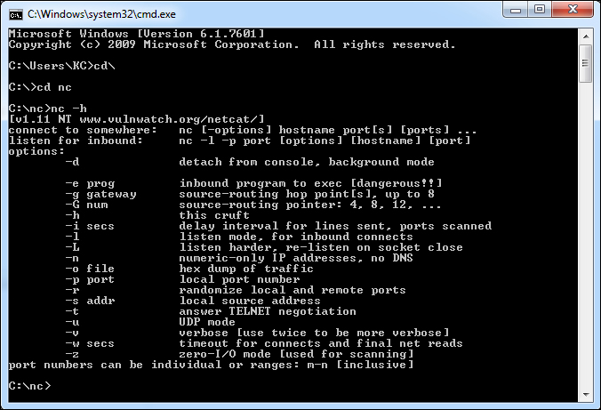

# Netcat

Netcat is the "swiss army knife" of networking. It is a simple networking program that can be used as a client or server. Any data that is received is printed to the terminal \(or file if using file redirection\). Netcat supports both IPv4/IPv6 and TCP/UDP. You can use Netcat to receive traffic you are sending, or to simulate a client accessing a server.

If you need to download Netcat, there should be a copy in the download file:

## Use Terminal to navigate to the downloaded file: "**nc111nt"**

To verify Netcat is working correctly type the command: **"nc -h"**

You should see something similar to the output above. This is the NetCat help menu. Which gives you the basic format for creating a Client and a Server, as well as all the options.

Most Linux distributions have Netcat pre-installed. So you should be able to use your VM to communicate with the Windows Netcat.

Some people have compiled thenetcatsource for Windows and posted the binaries online. There is one binary for IPv4 and one for IPv6, however they have the exact same functionality.

**nc.exe is for IPv4**

**nc6.exe is for IPv6**

## Useful netcat switches:

-l: listen

-L: listen harder \(Windows only, automatically listens again after

connection terminates\)

-p: Source port to listen on

-u: UDP mode  
**Netcat listener \("server"\)**

•nc -lp 1337 \(-p is only for listeners\)

**Netcat connector \("client"\)**

•nc 192.168.1.1 1337

**File redirection**

•netcat supports file redirection.

•Files piped into netcat will send be sent over the wire.

•Output from netcat may be piped to a file

**Loops can be used as a make-shift server**

•nc -Lp 80 &lt; index.html

•while true; do sudo nc -lp 80 &lt; index.html; done \(Equivalent to -L in Windows\)

