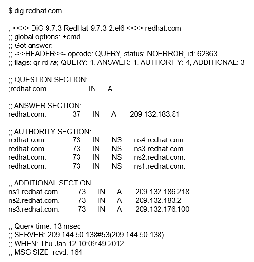

# Dig - Output

* **Header:** This displays the dig command version number, the global options used by the dig command, and some additional header information.
* **QUESTION SECTION:** This displays the question it asked the DNS. i.e. This is your input. Since we said ‘**dig redhat.com**’, and the default type dig command uses an A record, it indicates in this section that we asked for the A record of the redhat.com website.
* **ANSWER SECTION:** This displays the answer it receives from the DNS. i.e. This is your output. This displays the A record of redhat.com.
* **AUTHORITY SECTION:** This displays the DNS name server that has the authority to respond to this query. Basically this displays available name servers of redhat.com.
* **ADDITIONAL SECTION:** This displays the ip address of the name servers listed in the AUTHORITY SECTION.
* **Stats section**  - at the bottom displays a few dig command statistics including how much time it took to execute this query.

### `+nocomments` – Turn off the comment lines.

### `+noauthority`– Turn off the authority section.

### `+noadditional`– Turn off the additional section.

### `+nostats`– Turn off the stats section.

### `+noanswer` – Turn off the answer section \(Of course, you wouldn’t want to turn off the answer section\).

## `$ dig redhat.com +noall+answer`

## `; <<>> DiG 9.7.3-RedHat-9.7.3-2.el6 <<>> redhat.com +noall+answer`

## `;; global options: +cmd`

## `redhat.com. 60 IN A 209.132.183.81`

